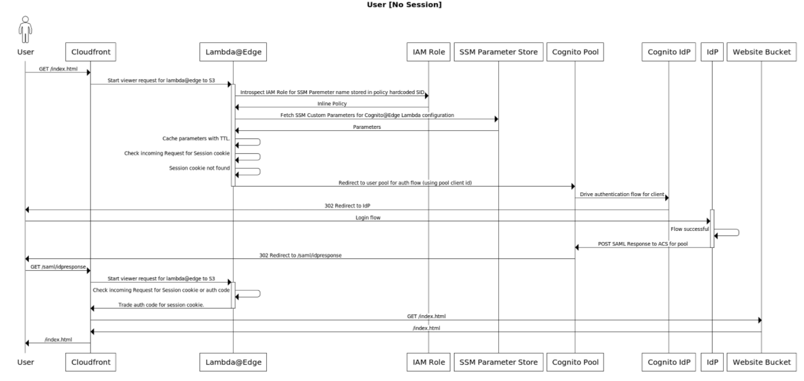

# terraform-aws-lambda-at-edge-cognito-authentication
This terraform module creates a Lambda@Edge Lambda to be used within a viewer policy of a CloudFront Distribution to
enforce Cognito Authentication through a configured Cognito User Pool.

## How it Works 


## Requirements
- Terraform version >= 1.0.X 
- NodeJS + NPM (compatible with NodeJS 18.X.X)
  - Used for `npm ci` dependency installation for Lambda@Edge Bundle.
- Terraform AWS Provider in `us-east-1`
  - Requirement for CloudFront + Lambda@Edge runtime.
- Existing Cognito User Pool and User Pool Client.

## Usage
To use this module, source it into one your Terraform project like so:

```
data "aws_cognito_user_pools" "user_pool" {
  name     = "my_cognito_pool_name"
}

resource "aws_cognito_user_pool_client" "cognito_client" {
  ...
}

module "cloudfront_cognito_auth_lambda" {
  source    = "git::https://github.com/disney/terraform-aws-lambda-at-edge-cognito-authentication.git?ref=<version-ref>"
  name                                      = "my-application"
  cognito_user_pool_name                    = data.aws_cognito_user_pools.user_pool.name
  cognito_user_pool_region                  = "us-east-1"
  cognito_user_pool_id                      = aws_cognito_user_pool_client.cognito_client.user_pool_id
  cognito_user_pool_app_client_id           = aws_cognito_user_pool_client.cognito_client.id

  tags = { foo = "bar" }
}
```

You can use the output of this module to pass as a rule on your CloudFront distribution cache on viewer-requests (typically on an S3 Bucket Origin with an OAI).

```
resource "aws_cloudfront_distribution" "my_cloudfront_distribution" {
  ...

  ordered_cache_behavior {
    ...
    lambda_function_association {
      event_type   = "viewer-request"
      lambda_arn   = module.cloudfront_cognito_auth_lambda.qualified_arn
    }
  }
}

```

### Lambda@Edge Destroy Issue
Note that if a destroy action is performed on this terraform module, terraform is unable to delete the Lambda@Edge that was published as a part of this infrastructure (This is noted by this [issue](https://github.com/hashicorp/terraform-provider-aws/issues/1721) on the Terraform provider). It will only be removed from the terraform state as the `skip_destroy` flag is set to true.

In order to properly delete this resource, it should be manually cleaned up, [instructions here](https://docs.aws.amazon.com/AmazonCloudFront/latest/DeveloperGuide/lambda-edge-delete-replicas.html).


<!-- BEGINNING OF PRE-COMMIT-TERRAFORM DOCS HOOK -->
## Requirements

| Name | Version |
|------|---------|
| <a name="requirement_terraform"></a> [terraform](#requirement\_terraform) | ~> 1.0 |
| <a name="requirement_aws"></a> [aws](#requirement\_aws) | >= 4.57 |

## Providers

| Name | Version |
|------|---------|
| <a name="provider_archive"></a> [archive](#provider\_archive) | 2.4.0 |
| <a name="provider_aws"></a> [aws](#provider\_aws) | 5.26.0 |
| <a name="provider_null"></a> [null](#provider\_null) | 3.2.2 |

## Modules

No modules.

## Resources

| Name | Type |
|------|------|
| [aws_iam_role.lambda_at_edge](https://registry.terraform.io/providers/hashicorp/aws/latest/docs/resources/iam_role) | resource |
| [aws_kms_key.ssm_kms_key](https://registry.terraform.io/providers/hashicorp/aws/latest/docs/resources/kms_key) | resource |
| [aws_lambda_function.cloudfront_auth_edge](https://registry.terraform.io/providers/hashicorp/aws/latest/docs/resources/lambda_function) | resource |
| [aws_ssm_parameter.lambda_configuration_parameters](https://registry.terraform.io/providers/hashicorp/aws/latest/docs/resources/ssm_parameter) | resource |
| [null_resource.install_lambda_dependencies](https://registry.terraform.io/providers/hashicorp/null/latest/docs/resources/resource) | resource |
| [archive_file.lambda_edge_bundle](https://registry.terraform.io/providers/hashicorp/archive/latest/docs/data-sources/file) | data source |
| [aws_caller_identity.current](https://registry.terraform.io/providers/hashicorp/aws/latest/docs/data-sources/caller_identity) | data source |
| [aws_iam_policy_document.allow_lambda_service_assume](https://registry.terraform.io/providers/hashicorp/aws/latest/docs/data-sources/iam_policy_document) | data source |
| [aws_region.current](https://registry.terraform.io/providers/hashicorp/aws/latest/docs/data-sources/region) | data source |

## Inputs

| Name | Description | Type | Default | Required |
|------|-------------|------|---------|:--------:|
| <a name="input_cognito_additional_settings"></a> [cognito\_additional\_settings](#input\_cognito\_additional\_settings) | Map of any to configure any additional cognito@edge parameters not handled by this module. | `any` | `{}` | no |
| <a name="input_cognito_cookie_expiration_days"></a> [cognito\_cookie\_expiration\_days](#input\_cognito\_cookie\_expiration\_days) | Number of days to keep the cognito cookie valid. | `number` | `7` | no |
| <a name="input_cognito_disable_cookie_domain"></a> [cognito\_disable\_cookie\_domain](#input\_cognito\_disable\_cookie\_domain) | Sets domain attribute in cookies, defaults to false. | `bool` | `false` | no |
| <a name="input_cognito_log_level"></a> [cognito\_log\_level](#input\_cognito\_log\_level) | Logging level. Default: 'silent' | `string` | `"silent"` | no |
| <a name="input_cognito_redirect_path"></a> [cognito\_redirect\_path](#input\_cognito\_redirect\_path) | Optional path to redirect to after a successful cognito login. | `string` | `""` | no |
| <a name="input_cognito_user_pool_app_client_id"></a> [cognito\_user\_pool\_app\_client\_id](#input\_cognito\_user\_pool\_app\_client\_id) | Cognito User Pool App Client ID for the targeted user pool. | `string` | n/a | yes |
| <a name="input_cognito_user_pool_app_client_secret"></a> [cognito\_user\_pool\_app\_client\_secret](#input\_cognito\_user\_pool\_app\_client\_secret) | Cognito User Pool App Client Secret for the targeted user pool. NOTE: This is currently not compatible with AppSync applications. | `string` | `null` | no |
| <a name="input_cognito_user_pool_domain"></a> [cognito\_user\_pool\_domain](#input\_cognito\_user\_pool\_domain) | Optional: Full Domain of the Cognito User Pool to utilize. Mutually exclusive with 'cognito\_user\_pool\_name'. | `string` | `""` | no |
| <a name="input_cognito_user_pool_id"></a> [cognito\_user\_pool\_id](#input\_cognito\_user\_pool\_id) | Cognito User Pool ID for the targeted user pool. | `string` | n/a | yes |
| <a name="input_cognito_user_pool_name"></a> [cognito\_user\_pool\_name](#input\_cognito\_user\_pool\_name) | Name of the Cognito User Pool to utilize. Required if 'cognito\_user\_pool\_domain' is not set. | `string` | `""` | no |
| <a name="input_cognito_user_pool_region"></a> [cognito\_user\_pool\_region](#input\_cognito\_user\_pool\_region) | AWS region where the cognito user pool was created. | `string` | `"us-west-2"` | no |
| <a name="input_lambda_runtime"></a> [lambda\_runtime](#input\_lambda\_runtime) | Lambda runtime to utilize for Lambda@Edge. | `string` | `"nodejs20.x"` | no |
| <a name="input_lambda_timeout"></a> [lambda\_timeout](#input\_lambda\_timeout) | Amount of timeout in seconds to set on for Lambda@Edge. | `number` | `5` | no |
| <a name="input_name"></a> [name](#input\_name) | Name to prefix on all infrastructure created by this module. | `string` | n/a | yes |
| <a name="input_tags"></a> [tags](#input\_tags) | Map of tags to attach to all AWS resources created by this module. | `map(string)` | `{}` | no |

## Outputs

| Name | Description |
|------|-------------|
| <a name="output_arn"></a> [arn](#output\_arn) | ARN for the Lambda@Edge created by this module. |
| <a name="output_qualified_arn"></a> [qualified\_arn](#output\_qualified\_arn) | Qualified ARN for the Lambda@Edge created by this module. |
<!-- END OF PRE-COMMIT-TERRAFORM DOCS HOOK -->
